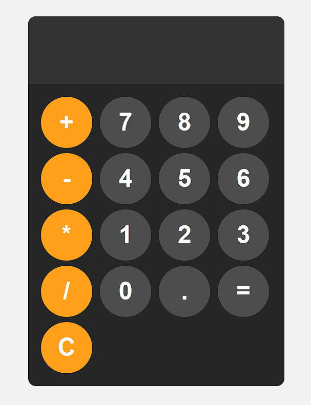

# Calculator Project

A simple, elegant calculator web application built with HTML, CSS, and JavaScript.

## Features

- Clean, modern UI with responsive design
- Basic arithmetic operations (addition, subtraction, multiplication, division)
- Decimal point support for floating-point calculations
- Error handling for invalid expressions
- Intuitive button layout with distinct operator styling

## Technologies Used

- HTML5
- CSS3
- Vanilla JavaScript

## Preview

The calculator features a dark theme with orange operation buttons and a large display for easy readability. The circular buttons provide a modern touch, and the interface is designed to be user-friendly.

## How to Use

1. Clone this repository
2. Open `index.html` in your browser
3. Use the calculator by clicking on the buttons or using your keyboard

## Implementation Details

- The calculator uses the JavaScript `eval()` function to evaluate mathematical expressions
- Error handling prevents crashes when invalid expressions are entered
- CSS Grid is used to create the responsive button layout
- Custom hover and active states enhance user experience

## Future Improvements

- Add keyboard support
- Implement more advanced operations (square root, percentages, etc.)
- Add calculation history feature
- Improve accessibility features

---

Feel free to contribute to this project by submitting a pull request!
